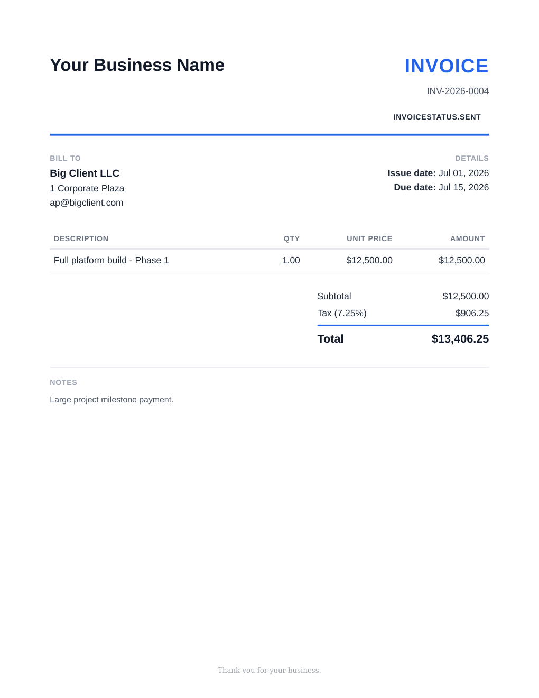

# Invoice Generator

A backend API for freelancers and small businesses to manage clients and generate
professional PDF invoices. Built with FastAPI, SQLAlchemy, PostgreSQL, and WeasyPrint.



## Live demo

**https://invoice-generator-6bl0.onrender.com** — deployed for evaluation
purposes (free tier, not for production use; see "Running locally" below to
self-host). Try it via the interactive docs at
[`/docs`](https://invoice-generator-6bl0.onrender.com/docs):

1. Register a user via `POST /auth/register`, or use the seeded demo account:
   `demo@example.com` / `demopassword123`
2. Click **Authorize** at the top of the docs page and log in
3. Try any endpoint directly in the browser, including downloading a real
   generated PDF from `GET /invoices/{id}/pdf`

Note: the free tier spins down after inactivity, so the first request after a
while may take 30-60 seconds to respond while it wakes back up.

## Features

- Client management (CRUD)
- Invoice management with nested line items, computed subtotal/tax/total
- Status lifecycle: `draft → sent → paid`, with a computed `overdue` view
  (a sent invoice past its due date — not a separate stored state)
- Draft-lock enforcement: once an invoice is sent, it's treated as a frozen
  document — line items and invoice fields can no longer be edited
- Professional PDF generation (`GET /invoices/{id}/pdf`) via WeasyPrint
- Filtering invoices by client and status
- Dockerized end-to-end — same image runs locally and in production

## Tech stack

- **API**: FastAPI + SQLAlchemy
- **DB**: PostgreSQL (Neon in production, containerized Postgres for local dev)
- **PDF**: WeasyPrint (HTML/CSS → PDF) + Jinja2 templates
- **Migrations**: Alembic
- **Tests**: pytest, 57 tests covering CRUD, totals math, status transitions,
  draft-lock enforcement, filtering, auth/multi-tenant isolation, and PDF
  generation (including extracting real text from generated PDFs to verify
  content, not just checking the file is well-formed)

## Running locally

Requires Docker Desktop.

```bash
docker compose up --build
```

This starts the API on `http://localhost:8000` and a Postgres container. First
build takes a few minutes (installing WeasyPrint's system dependencies).
Database schema is managed by Alembic migrations, which run automatically
before the server starts (see `Dockerfile`'s `CMD` / `docker-compose.yml`'s
`command`). To generate a new migration after changing a model:
```bash
docker compose exec api alembic revision --autogenerate -m "describe the change"
docker compose exec api alembic upgrade head
```

Run the test suite:
```bash
docker compose exec api pytest tests/ -v
```

Seed demo data (a demo user, 3 clients, and 4 invoices covering every status):
```bash
docker compose exec api python scripts/seed.py
```

## Authentication

Every endpoint except `/health`, `/auth/register`, and `/auth/login` requires a
JWT bearer token. Multi-tenant: each user only sees and can act on their own
clients and invoices — accessing another user's data returns 404, not 403 (so
the API never confirms whether a given ID exists at all for a user it doesn't
belong to).

```bash
# Register
curl -X POST http://localhost:8000/auth/register \
  -H "Content-Type: application/json" \
  -d '{"email": "you@example.com", "password": "a-real-password"}'

# Log in (form-encoded, not JSON -- this is what makes the FastAPI docs'
# "Authorize" button work out of the box)
curl -X POST http://localhost:8000/auth/login \
  -d "username=you@example.com&password=a-real-password"

# Use the returned access_token on every other request
curl http://localhost:8000/clients \
  -H "Authorization: Bearer <token>"
```

## API overview

| Method | Endpoint | Description |
|---|---|---|
| POST | `/auth/register` | Create a user account |
| POST | `/auth/login` | Log in, returns a JWT access token |
| POST | `/clients` | Create a client |
| GET | `/clients` | List clients |
| GET | `/clients/{id}` | Get a client |
| PATCH | `/clients/{id}` | Update a client |
| DELETE | `/clients/{id}` | Delete a client |
| POST | `/invoices` | Create an invoice (with nested line items) |
| GET | `/invoices?client_id=&status=` | List/filter invoices |
| GET | `/invoices/{id}` | Get an invoice |
| PATCH | `/invoices/{id}` | Update an invoice (draft only) |
| DELETE | `/invoices/{id}` | Delete an invoice (draft only) |
| POST | `/invoices/{id}/send` | draft → sent |
| POST | `/invoices/{id}/mark-paid` | sent → paid |
| POST | `/invoices/{id}/line-items` | Add a line item (draft only) |
| PATCH | `/line-items/{id}` | Update a line item (draft only) |
| DELETE | `/line-items/{id}` | Delete a line item (draft only) |
| GET | `/invoices/{id}/pdf` | Download the invoice as a PDF |

## Known gaps

- **No email delivery.** PDFs are generated on demand, not sent automatically.
- **Invoice numbers aren't gap-proof.** They're derived by counting existing
  invoices per year, so a deleted invoice can leave a gap in the sequence.
- **No password reset flow.** Registration and login only, for now.

## Future work

- Stripe payment links on invoices, so clients can pay directly from the PDF
  or a hosted invoice page
- Email delivery of invoices (SendGrid/SES)
- Recurring/subscription invoices
- Multi-currency support
- Partial payments / payment history per invoice
- Cron-based auto-flip to `overdue` (currently computed at read time instead)
- Customizable branding per business (logo, colors)
